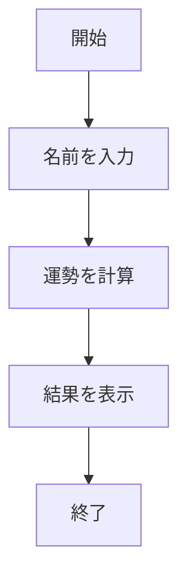

# webpro_06

## このプログラムについて

## ファイル一覧

ファイル名 | 説明
-|-
app5.js | プログラム本体
public/janken.html | じゃんけんの開始画面

<<<<<<< HEAD

=======
>>>>>>> 6b96fe8e846ca9bbd1521961c823cd097a6e1918
1行目は表の見出しである． | で区切る．
2行目は表のフォーマットである． -|- は項目が2つあることを示す．
（3つの場合は -|-|- ，4つの場合は -|-|-|- と記す．
3行目以降は表の内容である． | で区切る．


```javascript
console.log( 'Hello' );
```

```mermaid
flowchart TD;
<<<<<<< HEAD
開始 --> 終了;
=======
    start["開始"] --> choose["手を選択"];
    choose --> compare{"勝敗の判定"};
    compare -->|勝ち| win["勝利"];
    compare -->|負け| lose["敗北"];
    compare -->|引き分け| draw["引き分け"];
    win --> end1["終了"];
    lose --> end1;
    draw --> end1;

>>>>>>> 6b96fe8e846ca9bbd1521961c823cd097a6e1918
```


```mermaid
flowchart TD;
<<<<<<< HEAD

start["開始"];
end1["終了"]
if{"条件に合うか"}
win["勝ち"]
loose["負け"]

start --> if
if -->|yes| win
win --> end1
if -->|no| loose
loose --> end1
```
=======
    start["開始"] --> input["目数を入力"];
    input --> roll["ランダムな目を生成"];
    roll --> display["結果を表示"];
    display --> end1["終了"];
```


>>>>>>> 6b96fe8e846ca9bbd1521961c823cd097a6e1918
