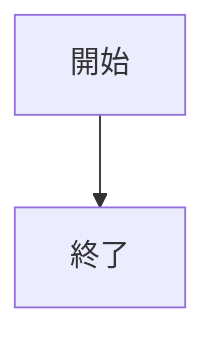
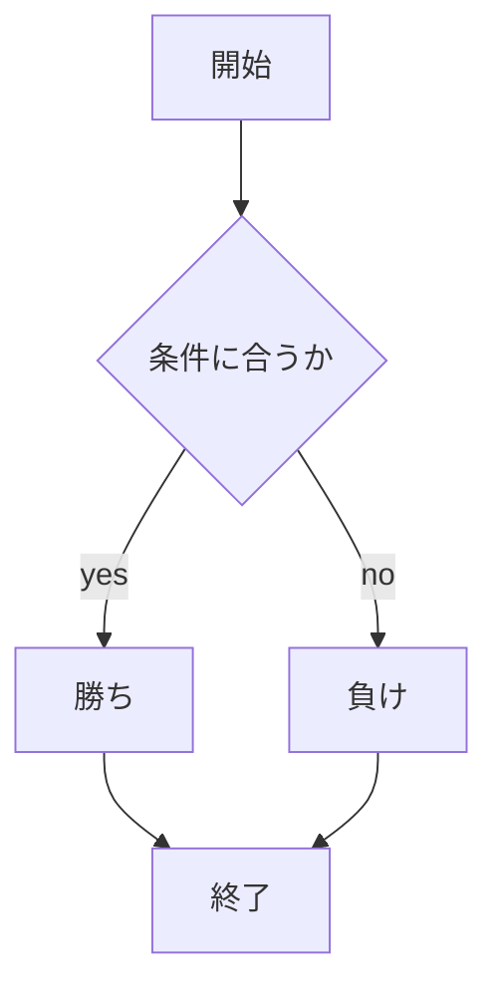

# webpro_06

## このプログラムについて

## ファイル一覧

ファイル名 | 説明
-|-
app5.js | プログラム本体
public/janken.html | じゃんけんの開始画面

1行目は表の見出しである． | で区切る．
2行目は表のフォーマットである． -|- は項目が2つあることを示す．
（3つの場合は -|-|- ，4つの場合は -|-|-|- と記す．
3行目以降は表の内容である． | で区切る．


```javascript
console.log( 'Hello' );
```





